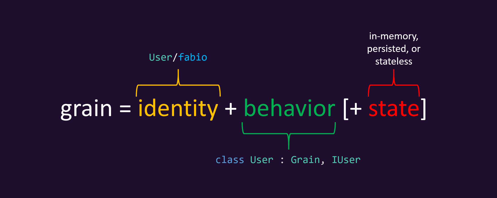

<p align="center">
  <image src="https://raw.githubusercontent.com/dotnet/orleans/gh-pages/assets/logo_full.png" alt="Orleans logo" width="600px">
</p>

[](http://www.nuget.org/profiles/Orleans)
[](https://gitter.im/dotnet/orleans?utm_source=badge&utm_medium=badge&utm_campaign=pr-badge)

Orleans is a cross-platform framework for building robust, scalable distributed applications.

It builds on the developer productivity of .NET and brings it to the world of distributed applications such as cloud services. Orleans scales from a single on-premises server to globally distributed, highly-available applications in the cloud.

Orleans takes familiar concepts like objects, interfaces, async/await, and try/catch and extends them to multi-server environments. As such, it helps developers experienced with single-server applications transition to building resilient, scalable cloud services and other distributed applications. For this reason, Orleans has often been referred to as "Distributed .NET".

It was created by [Microsoft Research](http://research.microsoft.com/projects/orleans/) and introduced the [Virtual Actor Model](http://research.microsoft.com/apps/pubs/default.aspx?id=210931) as a novel approach to building a new generation of distributed systems for the Cloud era. The core contribution of Orleans is a programming model which tames the complexity inherent to highly-parallel distributed systems without restricting capabilities or imposing onerous constraints on the developer.



The fundamental building block in any Orleans application is a *grain*. Grains are entities comprising user-defined identity, behavior, and state. Grain identities are user-defined keys which make make Grains always available for invocation. Grains can be invoked by other grains or by external clients such as Web frontends, via strongly-typed communication interfaces (contracts). Each grain is an instance of a class which implements one or more of these interfaces.

Grains can have volatile and/or persistent state that can be stored in any storage system. As such, grains implicitly partition application state, enabling automatic scalability and simplifying recovery from failures. Grain state is kept in memory while the grain is active, leading to lower latency and less load on data stores.

<p align="center">
  <image src="assets/managed_lifecycle.svg" alt="A diagram showing the managed lifecycle of a grain">
</p>

Instantiation of grains is automatically performed on demand by the Orleans runtime. Grains which are not used are automatically removed from memory to free up resources. This is possible because of their stable identity, which allows invoking grains whether they are already loaded into memory or not. This also allows for transparent recovery from failure because the caller does not need to know on which server a grain is instantiated on at any point in time. Grains have a managed lifecycle, with the Orleans runtime responsible for activating/deactivating, and placing/locating grains as needed. This allows the developer to write code as if all grains were always in-memory.

Taken together, the stable identity, statefulness, and managed lifecycle of Grains are core factors that make systems built on Orleans scalable, performant, &amp; reliable without forcing developers to write complex distributed systems code.

### Example: Internet of Things Cloud Backend

Consider a cloud backend for an [Internet of Things](https://en.wikipedia.org/wiki/Internet_of_things) system. This application needs to process incoming device data, filter, aggregate, and process this information, and enable sending commands to devices. In Orleans, it is natural to model each device with a grain which becomes a *digital twin* of the physical device it corresponds to. These grains keep the latest device data in memory, so that they can be quickly queried and processed without the need to communicate with the physical device directly. By observing streams of time-series data from the device, the grain can detect changes in conditions, such as measurements exceeding a threshold, and trigger an action.

A simple thermostat could be modeled as follows:

``` C#
public interface IThermostat : IGrainWithStringKey
{
  Task<List<Command>> OnUpdate(ThermostatStatus update);
}
```

Events arriving from the thermostat from a Web frontend can be sent to its grain by invoking the `OnUpdate` method which optionally returns a command back to the device.

``` C#
var thermostat = client.GetGrain<IThermostat>(id);
return await thermostat.OnUpdate(update);
```

The same thermostat grain can implement a separate interface for control systems to interact with:

``` C#
public interface IThermostatControl : IGrainWithStringKey
{
  Task<ThermostatStatus> GetStatus();

  Task UpdateConfiguration(ThermostatConfiguration config);
}
```

These two interfaces (`IThermostat` and `IThermostatControl`) are implemented by a single implementation class:

``` C#
public class ThermostatGrain : Grain, IThermostat, IThermostatControl
{
  private ThermostatStatus _status;
  private List<Command> _commands;

  public Task<List<Command>> OnUpdate(ThermostatStatus status)
  {
    _status = status;
    var result = _commands;
    _commands = new List<Command>();
    return Task.FromResult(result);
  }

  public Task<ThermostatStatus> GetStatus() => Task.FromResult(_status);
  
  public Task UpdateConfiguration(ThermostatConfiguration config)
  {
    _commands.Add(new ConfigUpdateCommand(config));
    return Task.CompletedTask;
  }
}
```

The grain class above does not persist its state. More thorough example demonstrating state persistence is available in the [documentation](https://dotnet.github.io/orleans/Documentation/grains/grain_persistence/index.html).

## Runtime

The Orleans runtime is what implements the programming model for applications.The main component of the runtime is the Silo, which is responsible for hosting grains. Typically, a group of Silos run as a cluster for scalability and fault-tolerance. When run as a cluster, silos coordinate with each other to distribute work, detect and recover from failures. The runtime enables grains hosted in the cluster to communicate with each other as if they are within a single process.

In addition to the core programming model, the silo provides grains with a set of runtime services, such as timers, reminders (persistent timers), persistence, transactions, streams, and more. See the [features section](#features) below for more detail.

Web frontends and other external clients call grains in the cluster using the client library which automatically manages network communication. Clients can also be co-hosted in the same process with silos for simplicity.

Orleans is compatible with .NET Standard 2.0 and above, running on Windows, Linux, and macOS.

## Scenarios

Orleans has been used in production since late 2011. **LIST KEY PRODUCTION USERS**

General overview of scenarios. Context-oriented compute. Systems which can be decomposed into fine-grained units. Low-latency/interactive/near-real-time workloads (fraud prevention). Batch processing workloads. Dynamic graph relationships.

* User profile/inventory/commerce - eg monetization << generalize this. Entity management systems such as user profiles, inventory, online commerce.
* IoT -variation of above. large streams of data from many devices. graph relationships
* Control Systems - eg thunderhead
* Game services - low latency, high scalability, variable load
* Stream Processing - eg playstream/maelstrom/halo?
* Anomaly Detection - Time-series Analysis, context, activity, etc

**LIST OF TYPICAL SCENARIOS**

**DISCUSS ANTI-PATTERNS / poor fit cases**

## Features

### Reminders &amp; Timers

### Persistence

**REWRITE REWRITE REWRITE**
The vast majority of applications need to deal with some kind of state, eg: user profiles, high scores, invitations, chat messages. This state must be persisted so that user data is not lost.

- pluggable
- simple to use
- entirely optional

### Consistency

**REWRITE REWRITE REWRITE**
Distributed systems are highly concurrent. Access to data needs to be controlled to ensure that invariants are not violated. Eg: to ensure that a seat on a plane is not assigned to multiple people at once.

### Distributed ACID Transactions

**REWRITE REWRITE REWRITE**
Many applications eventually need to perform some kind of multi-object transaction. Eg, to ensure that money does not appear/disappear during a bank account transaction. Unfortunately, the move to Microservices (and by extension Serverless architectures) has left users without support for transactions, leaving users to attempt to regain some transactional guarantees on their own. This is very difficult, though, since transactions are highly nuanced. “Every sufficiently large deployment of microservices contains an ad-hoc, informally specified, bug-ridden, slow implementation of half of transactions”.

### Streams

### Caching

**REWRITE REWRITE REWRITE**
Developers leverage caches to alleviate pressure on databases, particularly in read-heavy workloads. Caches usually need to be invalidated in order to retain correctness, but this is a notoriously difficult process without some kind of coordination.

### Grain Placement

When a grain is activated in Orleans, the runtime decides which server to activate that grain on. This is called grain placement. The placement process in Orleans is fully configurable: developers can choose from a set of out-of-the-box placement policies such as random, prefer-local, and load-based, or custom logic can be configured. This allows for full flexibility in deciding where grains are created. For example, grains can be placed on a server close to resources which they need to operate on or other grains which they communicate with.

### Grain Versioning


### Stateless Workers

## Documentation

Documentation is located [here](https://dotnet.github.io/orleans/Documentation/)

## Getting Started

Please see the [getting started tutorial](https://dotnet.github.io/orleans/Documentation/tutorials_and_samples/tutorial_1.html).

### Building

Run the `Build.cmd` script to build the NuGet packages locally,
then reference the required NuGet packages from `/Artifacts/Release/*`.
You can run `Test.cmd` to run all BVT tests, and `TestAll.cmd` to also run Functional tests.

## Official Builds

The stable production-quality release is located [here](https://github.com/dotnet/orleans/releases/latest).

The latest clean development branch build from CI is located: [here](https://ci.dot.net/job/dotnet_orleans/job/master/job/bvt/lastStableBuild/artifact/)

Nightly builds are published to https://dotnet.myget.org/gallery/orleans-ci . These builds pass all functional tests, but are not thoroughly tested as the stable builds or pre-release builds we push to NuGet.org

To use nightly builds in your project, add the MyGet feed using either of the following methods:

1. Changing the .csproj file to include this section:

```xml
  <RestoreSources>
    $(RestoreSources);
    https://dotnet.myget.org/F/orleans-ci/api/v3/index.json;
  </RestoreSources>
```

or

2. Creating a `NuGet.config` file in the solution directory with the following contents:

```xml
<?xml version="1.0" encoding="utf-8"?>
<configuration>
 <packageSources>
  <clear />
  <add key="orleans-ci" value="https://dotnet.myget.org/F/orleans-ci/api/v3/index.json" />
  <add key="nuget" value="https://api.nuget.org/v3/index.json" />
 </packageSources>
</configuration>
```

## Community

* Ask questions by [opening an issue on GitHub](https://github.com/dotnet/orleans/issues) or on [Stack Overflow](https://stackoverflow.com/questions/ask?tags=orleans)
* [Chat on Gitter](https://gitter.im/dotnet/orleans)
* [Orleans Blog](https://dotnet.github.io/orleans/blog/)
* Follow the [@msftorleans](https://twitter.com/msftorleans) Twitter account for Orleans announcements.
* [OrleansContrib - GitHub organization for community add-ons to Orleans](https://github.com/OrleansContrib/) Various community projects, including Monitoring, Design Patterns, Storage Providers, etc.
* Guidelines for developers wanting to [contribute code changes to Orleans](http://dotnet.github.io/orleans/Community/Contributing.html).
* You are also encouraged to report bugs or start a technical discussion by starting a new [thread](https://github.com/dotnet/orleans/issues) on GitHub.

## License

This project is licensed under the [MIT license](https://github.com/dotnet/orleans/blob/master/LICENSE).

## Quick Links

* [Microsoft Research project page](http://research.microsoft.com/projects/orleans/)
* Technical Report: [Distributed Virtual Actors for Programmability and Scalability](http://research.microsoft.com/apps/pubs/default.aspx?id=210931)
* [Orleans Documentation](http://dotnet.github.io/orleans/)
* [Contributing](http://dotnet.github.io/orleans/Community/Contributing.html)

This project has adopted the [Microsoft Open Source Code of Conduct](https://opensource.microsoft.com/codeofconduct/). For more information see the [Code of Conduct FAQ](https://opensource.microsoft.com/codeofconduct/faq/) or contact [opencode@microsoft.com](mailto:opencode@microsoft.com) with any additional questions or comments.
