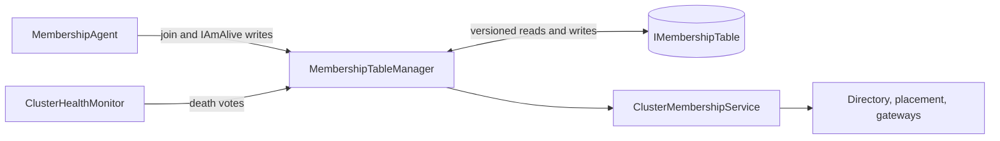
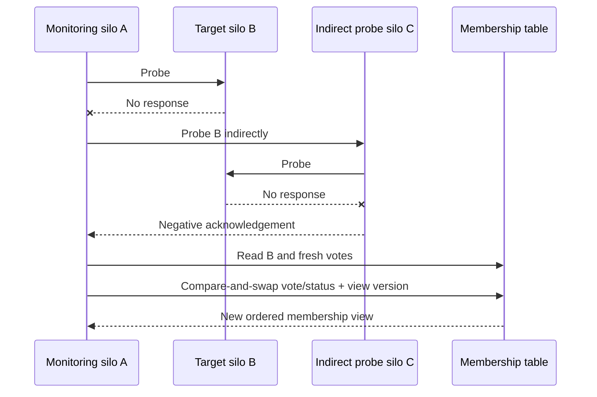

# Cluster membership protocol

Cluster membership supplies the rest of the runtime with **canonical membership views**: committed cluster membership state identified by a cluster-wide version. Orleans combines an <xref:Orleans.IMembershipTable> with direct peer probes. The table coordinates changes to membership; probes measure the communication path used for grain calls and runtime messages.

## Identity, status, and views

A silo identity includes its advertised endpoint and a generation value, so a restarted process at the same endpoint is a new identity. The membership protocol advances its <xref:Orleans.Runtime.SiloStatus> through `Created`, `Joining`, `Active`, and termination (`ShuttingDown`, `Stopping`, `Dead`). Failure can take an identity directly to `Dead`; shutdown can skip intermediate states. `Dead` is terminal for that identity. The protocol chooses forward transitions and uses conditional writes to protect them against competing writers.

**Monotonic versioning of canonical membership views** has two guarantees:

- Each successful atomic membership-table mutation commits version `N + 1` together with its row changes, starting from version `N`. This includes inserts, status changes, suspect-vote updates, and dead-row compaction. A failed conditional write preserves version `N` and all rows.
- Within a cluster, version `N` identifies one canonical membership view. Two silos which read version `N` agree on its versioned membership state. A reader can move directly from `N` to `N + 2` when another change commits between refreshes; both `N + 1` and `N + 2` were individually committed.

The integer <xref:Orleans.TableVersion.Version> orders views. The table and row ETags are opaque optimistic-concurrency tokens. The protocol reads a view, prepares a legal mutation using <xref:Orleans.TableVersion.Next*>, and supplies the read ETags to the provider. A concurrent change invalidates the relevant token, so the caller rereads and reevaluates its mutation against the new view.

Providers can use table-wide concurrency tokens for rows. A successful change
to one row can therefore refresh the tokens returned for other rows while their
membership fields remain unchanged.

Version allocation uses checked arithmetic. Exhausting the integer version range
raises an overflow error before a new write is submitted, preserving the last
committed view. A deployment which approaches this limit needs a new cluster
identity and membership history.

Canonical view identity covers the complete membership row set and its versioned fields, including retained `Dead` rows. The independently updated `IAmAliveTime` and row ETags can differ at the same view version. Compaction removes eligible dead rows and atomically commits the next view version. The removed identities remain terminal.

A cleanup call can use several atomic batches to respect backend transaction limits. Each nonempty batch advances the version by exactly one; readers can skip intermediate cleanup views. Empty cleanup preserves the version. Automatic row expiration must be disabled so every removal participates in this versioning protocol.

A cluster's administrative deletion ends its stored history; use a fresh cluster identity for a new deployment.

## Consume membership views

Resolve <xref:Orleans.Runtime.IClusterMembershipService> from dependency injection when a silo-hosted service or runtime component needs the cluster view. <xref:Orleans.Runtime.IClusterMembershipService.CurrentSnapshot> returns the current local, immutable <xref:Orleans.Runtime.ClusterMembershipSnapshot> without waiting for storage access.

`MembershipTableManager` reads canonical membership views and receives gossip snapshots. It publishes locally accepted snapshots through `ClusterMembershipService`. Its startup snapshot uses <xref:Orleans.Runtime.MembershipVersion.MinValue> while the silo is establishing membership. Local startup and self-termination bookkeeping are projections of the protocol's state; the provider's committed view and version are the coordination boundary.

<xref:Orleans.Runtime.IClusterMembershipService.MembershipUpdates> is an asynchronous sequence which first yields the current local snapshot and then yields snapshots with strictly increasing <xref:Orleans.Runtime.ClusterMembershipSnapshot.Version> values. Consumers retain each snapshot as a complete view and compute changes from the last snapshot they processed. Intermediate versions can be skipped. Equal versions identify the same canonical versioned state, which lets higher layers use version comparisons to decide whether their membership work is current.

Compare the snapshot version with the required <xref:Orleans.Runtime.MembershipVersion>. When the local view must reach a minimum version, await <xref:Orleans.Runtime.IClusterMembershipService.Refresh*> with that version; it completes after the local snapshot catches up. The [BasicClustering sample](https://github.com/dotnet/orleans/tree/main/samples/BasicClustering) demonstrates a hosted service which consumes membership updates.

## Joining

A starting silo writes its row, becomes `Joining`, and validates two-way connectivity with active members before becoming `Active`. This prevents a partitioned process from silently joining one side of a cluster.

The periodic <xref:Orleans.MembershipEntry.IAmAliveTime> value records reported liveness for diagnostics and startup disaster recovery. A sufficiently stale active row can be excluded from the joining connectivity check, allowing a cluster to recover after all processes were lost without cleanly declaring each other dead.

### Independent liveness timestamps

<xref:Orleans.IMembershipTable.UpdateIAmAliveAsync*> atomically retains the maximum of the stored and supplied timestamps. It preserves the table version and all versioned membership fields. Repeated timestamps, delayed writes, and a backward adjustment of a silo's wall clock leave the stored maximum intact. The row ETag can change as a consequence of this write.

A delayed liveness report for an identity already removed by compaction preserves
its absence and the current view version.

Versioned row updates preserve the same maximum. For example, a writer can read a row at time `T1`, another writer can publish `IAmAliveTime = T2`, and the first writer can then update the status using its old row. The provider either rejects an invalidated ETag or atomically merges the timestamp while committing the status and next version. The stored timestamp remains `T2` when `T2 > T1`.

Read responses and gossip can arrive in a different order from their production. The membership manager retains the maximum timestamp it has observed for an identity when combining those observations. This observation rule complements the provider's persisted maximum. Neither operation advances the canonical view version solely because the timestamp advanced.

## Failure detection and death votes 

Active silos monitor peers selected from the membership view. `ClusterHealthMonitor` sends probes over silo-to-silo messaging, tracks consecutive failures, and can use indirect probes to distinguish a failed target from an unhealthy observer. A failed monitor writes a timestamped vote into the target's membership row.

Each observer maintains a [Phi Accrual failure detector](https://paperhub.s3.amazonaws.com/f516fdfa940caa08c679d3946b273128.pdf) for each peer. The detector models successful direct-probe round-trip times and estimates the timeout at which the probability of a later response is sufficiently low. The timeout starts at <xref:Orleans.Configuration.ClusterMembershipOptions.ProbeTimeout?displayProperty=nameWithType> and adapts after enough observations. Failures are excluded because they only show that the response exceeded the current timeout, while indirect results are excluded because they measure a different observer's network path.

The learned timeout also determines probe cadence. Each probe is scheduled relative to the previous probe's start, so a quick response waits for the remainder of the current timeout while a probe which consumes its timeout is followed immediately by the next attempt. Local-health and indirect-hop extensions are applied to the learned timeout before it is clamped between <xref:Orleans.Configuration.ClusterMembershipOptions.MinProbeTimeout?displayProperty=nameWithType> and <xref:Orleans.Configuration.ClusterMembershipOptions.MaxProbeTimeout?displayProperty=nameWithType>. Debugger-specific extensions are applied after the clamp so a paused process is not accused because of the configured production bound.

Declaring a member dead requires enough unexpired votes from distinct observers. The provider validates both the table ETag and target row ETag while atomically committing the vote/status update and next canonical view version. A conflicting update causes the writer to reread and reevaluate.

A row's `Dead` status is terminal. A partitioned process terminates when it learns that the cluster declared it dead. Its host can restart it with a new generation.

## Default settings 

The defaults are defined by <xref:Orleans.Configuration.ClusterMembershipOptions>:

| Option | Default | Protocol role |
| --- | ---: | --- |
| <xref:Orleans.Configuration.ClusterMembershipOptions.NumProbedSilos?displayProperty=nameWithType> | 10 | Number of peers monitored by each silo |
| <xref:Orleans.Configuration.ClusterMembershipOptions.ProbeTimeout?displayProperty=nameWithType> | 5 seconds | Initial timeout and probe period before the peer has supplied enough evidence |
| <xref:Orleans.Configuration.ClusterMembershipOptions.MinProbeTimeout?displayProperty=nameWithType> | Half the initial timeout (2.5 seconds by default) | Lower bound for an effective probe timeout |
| <xref:Orleans.Configuration.ClusterMembershipOptions.MaxProbeTimeout?displayProperty=nameWithType> | Four times the initial timeout (20 seconds by default) | Upper bound for an effective probe timeout |
| <xref:Orleans.Configuration.ClusterMembershipOptions.NumMissedProbesLimit?displayProperty=nameWithType> | 3 | Failed probes before a death vote |
| <xref:Orleans.Configuration.ClusterMembershipOptions.NumVotesForDeathDeclaration?displayProperty=nameWithType> | 2 | Fresh votes required to mark a member dead |
| <xref:Orleans.Configuration.ClusterMembershipOptions.DeathVoteExpirationTimeout?displayProperty=nameWithType> | 2 minutes | Lifetime of a death vote |
| <xref:Orleans.Configuration.ClusterMembershipOptions.TableRefreshTimeout?displayProperty=nameWithType> | 1 minute | Fallback membership-table refresh period |
| <xref:Orleans.Configuration.ClusterMembershipOptions.IAmAliveTablePublishTimeout?displayProperty=nameWithType> | 30 seconds | Membership-row liveness timestamp period |

These values are protocol parameters, not independent timers: indirect probing, local health, scheduling delays, and table contention all affect observed detection time. Following [Lifeguard's local-health awareness principle](https://arxiv.org/abs/1707.00788), the runtime increases probe tolerance when `LocalSiloHealthMonitor` detects thread-pool delay, timer delay, or other local distress, reducing false accusations from an unhealthy observer.

## Membership-table contract 

The guarantees belong to specific layers:

| Layer | Responsibility and guarantee |
| --- | --- |
| Membership protocol | Chooses forward status transitions, uses a new generation on restart, proposes exactly the next table version, and reevaluates conflicts against a fresh view. |
| Membership provider | Validates concurrency tokens and commits each row mutation with its version atomically. Reads return rows and the matching version from one committed state. Both write paths preserve the maximum liveness timestamp. |
| Membership manager and service | Combine storage and gossip observations, retain observed liveness maxima, and publish local snapshots with increasing canonical view versions to consumers. |
| Directory, placement, and other consumers | Use those complete versioned views as inputs to their own protocols, including directory ownership and activation placement. |

Provider operations uphold the following behavioral contract:

| Operation | Outcome |
| --- | --- |
| Initialize | Establishes an empty cluster's initial version; repeated initialization preserves existing rows and versions. |
| Read a row or the whole table | Returns a coherent committed state and its version. A missing row still returns the matching table version. Retained results stay independent of later writes. |
| Insert | Conditionally inserts a new identity and commits the next version in one operation. An existing identity or stale table ETag returns `false` with every stored value unchanged. |
| Update | Conditionally updates an existing identity and commits the next version. A missing row, stale row ETag, or stale table ETag returns `false` with every stored value unchanged. |
| Update liveness | Retains the maximum timestamp while preserving all versioned fields and the table version, including its ETag. |
| Cleanup | Atomically removes sufficiently old `Dead` rows and advances the version once per nonempty committed batch. Preserves every non-dead row. Retention considers startup, liveness, and suspect-vote timestamps, so recent death declarations remain visible. |
| Delete a cluster | Deletes only the selected cluster's membership data during administrative teardown. A provider scoped to one cluster can reject a foreign cluster ID with an argument error, preserving all stored data. |

The backing store must provide these semantics across independently constructed provider instances. A process-local lock coordinates only that process; cluster-wide arbitration requires backend transactions, compare-and-swap, or an equivalent shared coordination mechanism. Paginated reads must maintain coherence across all pages and the version row. Individually consistent row reads can still assemble a torn view if a versioned write commits between them.

Table unavailability favors safety over liveness. Existing silos can continue processing calls while membership changes wait for storage to recover. Providers surface infrastructure failures so the protocol can apply its retry and shutdown policy. Cancellation or a lost response can race with a committed write; the caller uses a fresh read and the concurrency tokens to determine subsequent actions.

Official providers adapt transactions, ETags, lightweight transactions, or compare-and-swap primitives to this contract. Provider selection and operational setup belong in the [deployment documentation](../deployment/index.md); the extension architecture is covered by [provider authoring](provider-authoring.md).

### Versioned compaction

`MembershipTableCleanupAgent` runs retention work on the first active silo in
natural silo-address order. It selects old dead entries using
<xref:Orleans.Configuration.ClusterMembershipOptions.DefunctSiloExpiration> and
<xref:Orleans.Configuration.ClusterMembershipOptions.MaxDefunctSiloEntries>.
The most recent startup, liveness, or suspect-vote timestamp determines an
entry's age, so a recent death declaration remains visible.

The provider revalidates eligibility when committing a deletion batch and
atomically advances the view version with the removals. Overlapping cleanup
attempts, concurrent liveness writes, and changes of cleanup leader are
coordinated by those storage transactions. Consumers observe compaction through
the same versioned snapshot stream as other membership changes.

The provider contract describes committed storage views. Snapshot consumers
can derive projections which omit terminal identities; those projections retain
the originating view version. Provider conformance compares full storage reads,
while snapshot-processing tests establish the separate rules for those projections.

### Provider conformance tests

The membership provider test kit exercises this contract through <xref:Orleans.IMembershipTable>. Deterministic cases cover conditional failures, independent readers and writers, racing mutations, status progression, liveness maxima, and cleanup. Accordant-generated operation sequences compare provider behavior with a model of the committed membership state and version. Run the suite against the provider's real shared backend using isolated test cluster identities.

See [provider conformance testing](provider-authoring.md#membership-provider-conformance) for integration and the division between generated histories and explicit concurrency cases.

## Protocol consumers

Higher-level services use the membership guarantees as their starting point:

- `LocalGrainDirectory` adjusts consistent-hash ownership after view changes.
- the experimental distributed directory runs an explicit range-transfer protocol.
- placement removes unavailable or overloaded candidates.
- clients refresh the gateway list.
- persistent-stream queue balancers redistribute queue responsibility.
- activation balancing protocols stop exchanging work with failed members.

This separation lets those services add stronger invariants without expanding the membership-table transaction.

## Source and tests

- [`IClusterMembershipService`](https://github.com/dotnet/orleans/blob/main/src/Orleans.Runtime/MembershipService/IClusterMembershipService.cs) exposes local snapshots, ordered updates, and minimum-version refresh.
- [`MembershipAgent`](https://github.com/dotnet/orleans/blob/main/src/Orleans.Runtime/MembershipService/MembershipAgent.cs) drives joining and active-state transitions.
- [`MembershipTableManager`](https://github.com/dotnet/orleans/blob/main/src/Orleans.Runtime/MembershipService/MembershipTableManager.cs) coordinates table updates and death declarations.
- [`ClusterHealthMonitor`](https://github.com/dotnet/orleans/blob/main/src/Orleans.Runtime/MembershipService/ClusterHealthMonitor.cs) owns peer monitoring.
- [`ClusterMembershipSnapshotTests`](https://github.com/dotnet/orleans/blob/main/test/Orleans.Runtime.Internal.Tests/ClusterMembershipSnapshotTests.cs) cover snapshot version and membership-change semantics.
- [`MembershipAgentTests`](https://github.com/dotnet/orleans/blob/main/test/Orleans.Core.Tests/Membership/MembershipAgentTests.cs) exercise startup connectivity.
- [`MembershipTableManagerTests`](https://github.com/dotnet/orleans/blob/main/test/Orleans.Core.Tests/Membership/MembershipTableManagerTests.cs) cover vote expiry and status changes.
